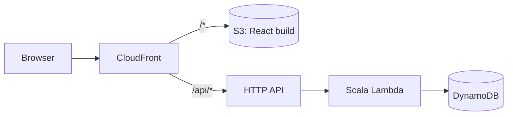

# Acro Tesseract

A wiki for acroyoga **poses** (graph nodes) and the **transitions** between them (directed edges).
This branch is the serverless rebuild described in [docs/acrotesseract-modernization.md](docs/acrotesseract-modernization.md):
a React SPA and a Scala Lambda API on DynamoDB, deployed with AWS CDK, in one Nx workspace.

**Live:** https://acrotesseract.com (`www.` redirects to it; the CloudFront URL https://d382inb5p2t1tt.cloudfront.net still works)

**Status:** the read-only site is live.
- **Pages:** browse and search poses and transitions, and explore the graph.
- **Data:** stored in DynamoDB, seeded from the placeholder [`data/data.json`](data/data.json).
- **Editing:** the create and update APIs exist but are switched off in prod until Google sign-in lands.
- **Details:** see the design doc's *Progress* section.

## Projects

| Project | Path | Stack |
|---|---|---|
| `acrotesseract-frontend` | `acrotesseract-frontend/` | React 19, Vite, Vitest |
| `acrotesseract-backend` | `acrotesseract-backend/` | Scala 3.9 (sbt), AWS Lambda (Java 21, arm64, SnapStart) |
| `acrotesseract-cdk` | `acrotesseract-cdk/` | AWS CDK (TypeScript), Jest |



## Developer onboarding

These steps take a new Mac from nothing to a green build. They assume Apple Silicon and zsh.

### 1. Install the tools

| Tool | Version | Install |
|---|---|---|
| Homebrew | any | https://brew.sh |
| Node.js + npm | 22 or newer | `brew install node`, or `nvm install 22` |
| JDK | 21 (matches the Lambda runtime) | `brew install openjdk@21` |
| sbt | any launcher (it reads `sbt.version` from `acrotesseract-backend/project/build.properties`) | `brew install sbt` |
| AWS CLI | v2 | `brew install awscli` |
| Podman *(optional)* | any | `brew install podman`, then `podman machine init && podman machine start`. Used for DynamoDB Local later |
| IDE | IntelliJ IDEA with the **Scala** plugin, or VS Code with **Metals** | Open the repo root. Import `acrotesseract-backend/` as an sbt project |

```sh
brew install node openjdk@21 sbt awscli
```

### 2. Point Java at JDK 21

Homebrew's `openjdk@21` is keg-only, so nothing finds it until you set `JAVA_HOME`. `brew install sbt` also pulls
in the newest `openjdk`. The build compiles with `-release:21`, so a newer JDK would still produce Java 21 bytecode,
but JDK 21 locally matches the Lambda runtime exactly. Add this to `~/.zshrc`:

```sh
export JAVA_HOME="$(brew --prefix openjdk@21)/libexec/openjdk.jdk/Contents/Home"
export PATH="$JAVA_HOME/bin:$PATH"
```

Then open a new terminal and check that `java -version` prints `21.x`.

### 3. Clone and install dependencies

```sh
git clone git@github.com:AndrewKL/acrotesseract.git
cd acrotesseract
git checkout modernization
npm install
```

`npm install` brings in Nx, the CDK CLI, React, Vite, Vitest and Jest. sbt downloads the Scala dependencies the first
time it runs.

### 4. Build and test

```sh
npx nx run-many -t build      # Lambda JAR (sbt lambda/assembly) + frontend (vite build)
npx nx run-many -t test       # sbt test, vitest, jest
```

The first sbt run downloads sbt itself and the Scala 3 compiler, which takes a few minutes. Later runs are cached by
sbt and by Nx.

### 5. Run it locally

In two terminals:

```sh
npx nx serve acrotesseract-backend    # API on http://localhost:8080
npx nx dev acrotesseract-frontend     # SPA on http://localhost:4200 (proxies /api to :8080)
```

Open http://localhost:4200. You should see the home page listing 16 poses and 30 transitions. Check
http://localhost:8080/api/health for `{"status":"ok","stage":"local"}`.

`nx serve acrotesseract-backend` holds sbt's lock. Stop it before running `nx build` or `nx test` on the backend.

### 6. AWS access (only needed to deploy)

The app deploys to the `acro-tesseract-prod` account (`640110193230`, `us-west-2`) in the Ferrocene AWS organization.
Ask an admin to assign your SSO user to that account in IAM Identity Center. Then add this to `~/.aws/config`:

```ini
[sso-session ferrocene]
sso_start_url = https://d-9267fb4e46.awsapps.com/start
sso_region = us-west-2
sso_registration_scopes = sso:account:access

[profile acrotesseract-prod]
sso_session = ferrocene
sso_account_id = 640110193230
sso_role_name = AdministratorAccess
region = us-west-2
```

Log in and check it:

```sh
aws sso login --sso-session ferrocene
aws sts get-caller-identity --profile acrotesseract-prod
```

The Nx CDK targets pass `--profile acrotesseract-prod` for you.

### 7. Google sign-in (once the auth phase lands)

Copy `acrotesseract-frontend/.env.example` to `acrotesseract-frontend/.env` and fill in the Google OAuth client IDs
from https://console.cloud.google.com/ (APIs & Services → Credentials). The local client's authorized JavaScript
origins must include `http://localhost:4200`. `.env` is gitignored.

## Common commands

```sh
npx nx show projects                       # list projects
npx nx run-many -t test                    # test everything
npx nx run-many -t build                   # build the Lambda JAR and the frontend

npx nx serve acrotesseract-backend         # API on http://localhost:8080 (sbt local/run)
npx nx dev acrotesseract-frontend          # SPA on http://localhost:4200, proxies /api to :8080

npx nx test acrotesseract-backend          # sbt test
npx nx test acrotesseract-frontend         # vitest
npx nx test acrotesseract-cdk              # jest template tests
npx nx typecheck acrotesseract-cdk

npx nx package acrotesseract-cdk           # builds backend + frontend, then cdk synth
npx nx diff acrotesseract-cdk              # cdk diff against the account
npx nx deploy acrotesseract-cdk            # deploy all stacks
npx nx deploy acrotesseract-cdk -c quick   # hotswap Lambda code, no rollback
```

The first deploy to a new account or region needs a CDK bootstrap (`npx cdk bootstrap aws://<account>/<region>`).
`us-west-2` and `us-east-1` (for the cert stack) are already bootstrapped in `640110193230`.

A full deploy (`npx nx deploy acrotesseract-cdk`) takes about 2 minutes when only code changes. Afterwards, check
https://acrotesseract.com/api/health.

### Domain

`acrotesseract.com` is registered at GoDaddy, but its DNS is in Route 53:
- **Nameservers:** the GoDaddy nameservers point at hosted zone `Z101167449K0416WE8MW` in the prod account.
- **Why the zone isn't in CDK:** it was created with the CLI, so a stack teardown can never change the nameservers
  the registrar points at.
- **What CDK manages:** the certificate (cert stack, `us-east-1`), and the IPv4 and IPv6 alias records for the bare
  domain and `www` (web stack).
- **The `www` redirect:** a CloudFront Function redirects `www.acrotesseract.com` to `acrotesseract.com`.
- **Where it's configured:** the domain and zone id are in `AcroTesseractStages.ts`.

## What's in the app

### Pages (`acrotesseract-frontend`)

| Route | Page |
|---|---|
| `/` | Intro and a search box that filters poses and transitions as you type |
| `/poses`, `/poses/:id` | Pose list (with transition counts) and pose detail: description, image, transitions from and to |
| `/transitions`, `/transitions/:id` | Transition list (with from → to) and transition detail: from/to poses, YouTube video, description |
| `/graph?focusPose=:id` | Cytoscape graph of every pose and transition. Click to open; `focusPose` highlights one pose's neighborhood |

The routes mirror the legacy Play app. [docs/frontend-pages-plan.md](docs/frontend-pages-plan.md) has the mapping and
the phase 2 (editing) plan.

### API (`acrotesseract-backend`)

Ids are UUIDs. Anything that isn't a canonical UUID gets `400`, and an unknown id gets `404`. Errors come back as
`{"error": "..."}`.

| Endpoint | Returns |
|---|---|
| `GET /api/health` | `{ status, stage }` |
| `GET /api/poses` | All poses, sorted by name |
| `GET /api/poses/{id}` | `{ pose, transitionsFrom, transitionsTo }` |
| `GET /api/transitions` | All transitions, sorted by name |
| `GET /api/transitions/{id}` | `{ transition, poseFrom, poseTo }` |
| `POST /api/poses` | Body `{ name, imageUrl?, descriptionMd? }` → `201` with the pose (`version: 1`) and a `Location` header |
| `PUT /api/poses/{id}` | Body `{ name, imageUrl?, descriptionMd?, version }` → `200` with the pose at `version + 1` |
| `POST /api/transitions` | Body `{ name, poseFrom, poseTo, descriptionMd?, youtubeUrl? }` → `201` |
| `PUT /api/transitions/{id}` | Same body plus `version` → `200` |

**How writes behave:**
- **Content type:** writes need `Content-Type: application/json`; anything else gets `415`.
- **Errors:**
  - A stale `version` or a duplicate name (case-insensitive) gets `409`.
  - A transition whose `poseFrom`/`poseTo` doesn't exist gets `400`.
  - Invalid fields get `400`.
- **Where they work:** writes are **disabled on deployed stages** and return `403` until sign-in exists. They work
  with `nx serve`. To turn them on for a stage, set `writesEnabled` in `acrotesseract-cdk/cdk/AcroTesseractStages.ts`.

```sh
curl -X POST localhost:8080/api/poses -H 'content-type: application/json' -d '{"name":"High Flying Whale"}'
```

### Data (`data/`) and DynamoDB

**Tables.** Each deployed stage has two tables: `acrotesseract-poses-<stage>` (key `poseId`) and
`acrotesseract-transitions-<stage>` (key `transitionId`). The design doc's *Data model* section covers the indexes.

**Seed data.** `data.json` is the seed: 16 placeholder L-basing poses and 30 transitions, using the legacy RDS column
names (`pose_id`, `pose_from`, …) with UUID ids. The seed tool copies it into the tables, keeping the ids and
skipping items that already exist, so it's safe to re-run and never overwrites edits:

```sh
npx nx seed acrotesseract-backend            # prod tables (needs the acrotesseract-prod SSO profile)
```

**Checks.** The backend checks `data.json` whenever it loads it: unique ids and names, and transitions that point at
real poses.
- **Validating edits:** after editing it, check it against `data.schema.json`:

  ```sh
  cd data && npx -p ajv-cli@5 -p ajv-formats ajv validate --spec=draft2020 -c ajv-formats -s data.schema.json -d data.json
  ```

- **Rebuilding:** the backend's Nx targets watch `data/data.json`, so the next build or test picks up the change.

**Local DynamoDB.** `nx serve acrotesseract-backend` serves `data.json` from memory by default, and edits are lost
when it stops. To run against DynamoDB Local instead:

```sh
podman run -d --rm -p 8000:8000 --name acro-ddb-local docker.io/amazon/dynamodb-local
npx nx seed acrotesseract-backend -c local     # creates the tables and loads data.json
npx nx serve acrotesseract-backend -c dynamodb
```

The backend's DynamoDB tests run the same repository contract against it:

```sh
cd acrotesseract-backend && DYNAMODB_ENDPOINT=http://localhost:8000 sbt store/test
```

Without `DYNAMODB_ENDPOINT` those tests are skipped.

## Stacks

Defined in `acrotesseract-cdk/cdk/AcroTesseractCdkApp.ts`, one set per stage in `AcroTesseractStages.ts`:

| Stack | Contents |
|---|---|
| `acrotesseract-storage-stack-<stage>` | DynamoDB tables `acrotesseract-poses-<stage>` and `acrotesseract-transitions-<stage>` (on-demand, PITR, deletion protection, retained) |
| `acrotesseract-api-stack-<stage>` | Scala Lambda + `live` alias, HTTP API, read/write on both tables, SSM (`/acrotesseract/<stage>/*`) access, `WRITES_ENABLED` from the stage config |
| `acrotesseract-web-stack-<stage>` | S3 + CloudFront (SPA + `/api/*`), a CloudFront Function that serves `index.html` for page routes, frontend upload, optional Route 53 records |
| `acrotesseract-cert-stack-<stage>` | ACM certificate in us-east-1; only when the stage has a `domain` |

## Legacy app

The original Play 2.6 app is on the `master` branch. Its RDS database no longer exists. `master` still has three pose
photos in `public/acrotesseract/img/poses/`, which aren't used here yet; see the design doc's *Data source* section.
