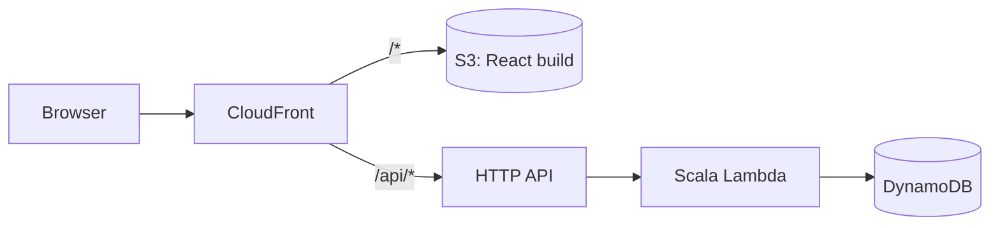

# Acro Tesseract

A wiki for acroyoga **poses** (graph nodes) and the **transitions** between them (directed edges).
This branch is the serverless rebuild described in [docs/acrotesseract-modernization.md](docs/acrotesseract-modernization.md):
a React SPA and a Scala Lambda API on DynamoDB, deployed with AWS CDK, in one Nx workspace.

## Projects

| Project | Path | Stack |
|---|---|---|
| `acrotesseract-frontend` | `acrotesseract-frontend/` | React 19, Vite, Vitest |
| `acrotesseract-backend` | `acrotesseract-backend/` | Scala 3.9 (sbt), AWS Lambda (Java 21, arm64, SnapStart) |
| `acrotesseract-cdk` | `acrotesseract-cdk/` | AWS CDK (TypeScript), Jest |



## Developer onboarding

These steps take a new Mac from nothing to a green build. They assume Apple Silicon and zsh.

### 1. Install the tools

| Tool | Version | Install |
|---|---|---|
| Homebrew | any | https://brew.sh |
| Node.js + npm | 22 or newer | `brew install node`, or `nvm install 22` |
| JDK | 21 (matches the Lambda runtime) | `brew install openjdk@21` |
| sbt | any launcher (it reads `sbt.version` from `acrotesseract-backend/project/build.properties`) | `brew install sbt` |
| AWS CLI | v2 | `brew install awscli` |
| Podman *(optional)* | any | `brew install podman`, then `podman machine init && podman machine start`. Used for DynamoDB Local later |
| IDE | IntelliJ IDEA with the **Scala** plugin, or VS Code with **Metals** | Open the repo root. Import `acrotesseract-backend/` as an sbt project |

```sh
brew install node openjdk@21 sbt awscli
```

### 2. Point Java at JDK 21

Homebrew's `openjdk@21` is keg-only, so nothing finds it until you set `JAVA_HOME`. `brew install sbt` also pulls
in the newest `openjdk`. The build compiles with `-release:21`, so a newer JDK would still produce Java 21 bytecode,
but JDK 21 locally matches the Lambda runtime exactly. Add this to `~/.zshrc`:

```sh
export JAVA_HOME="$(brew --prefix openjdk@21)/libexec/openjdk.jdk/Contents/Home"
export PATH="$JAVA_HOME/bin:$PATH"
```

Then open a new terminal and check that `java -version` prints `21.x`.

### 3. Clone and install dependencies

```sh
git clone git@github.com:AndrewKL/acrotesseract.git
cd acrotesseract
git checkout modernization
npm install
```

`npm install` brings in Nx, the CDK CLI, React, Vite, Vitest and Jest. sbt downloads the Scala dependencies the first
time it runs.

### 4. Build and test

```sh
npx nx run-many -t build      # Lambda JAR (sbt lambda/assembly) + frontend (vite build)
npx nx run-many -t test       # sbt test, vitest, jest
```

The first sbt run downloads sbt itself and the Scala 3 compiler, which takes a few minutes. Later runs are cached by
sbt and by Nx.

### 5. Run it locally

In two terminals:

```sh
npx nx serve acrotesseract-backend    # API on http://localhost:8080
npx nx dev acrotesseract-frontend     # SPA on http://localhost:4200 (proxies /api to :8080)
```

Open http://localhost:4200. It should say `API: ok (local)`.

### 6. AWS access (only needed to deploy)

The app deploys to the `acro-tesseract-prod` account (`640110193230`, `us-west-2`) in the Ferrocene AWS organization.
Ask an admin to assign your SSO user to that account in IAM Identity Center. Then add this to `~/.aws/config`:

```ini
[sso-session ferrocene]
sso_start_url = https://d-9267fb4e46.awsapps.com/start
sso_region = us-west-2
sso_registration_scopes = sso:account:access

[profile acrotesseract-prod]
sso_session = ferrocene
sso_account_id = 640110193230
sso_role_name = AdministratorAccess
region = us-west-2
```

Log in and check it:

```sh
aws sso login --sso-session ferrocene
aws sts get-caller-identity --profile acrotesseract-prod
```

The Nx CDK targets pass `--profile acrotesseract-prod` for you.

### 7. Google sign-in (once the auth phase lands)

Copy `acrotesseract-frontend/.env.example` to `acrotesseract-frontend/.env` and fill in the Google OAuth client IDs
from https://console.cloud.google.com/ (APIs & Services → Credentials). The local client's authorized JavaScript
origins must include `http://localhost:4200`. `.env` is gitignored.

## Common commands

```sh
npx nx show projects                       # list projects
npx nx run-many -t test                    # test everything
npx nx run-many -t build                   # build the Lambda JAR and the frontend

npx nx serve acrotesseract-backend         # API on http://localhost:8080 (sbt local/run)
npx nx dev acrotesseract-frontend          # SPA on http://localhost:4200, proxies /api to :8080

npx nx test acrotesseract-backend          # sbt test
npx nx test acrotesseract-frontend         # vitest
npx nx test acrotesseract-cdk              # jest template tests
npx nx typecheck acrotesseract-cdk

npx nx package acrotesseract-cdk           # builds backend + frontend, then cdk synth
npx nx diff acrotesseract-cdk              # cdk diff against the account
npx nx deploy acrotesseract-cdk            # deploy all stacks
npx nx deploy acrotesseract-cdk -c quick   # hotswap Lambda code, no rollback
```

The first deploy to a new account or region needs a CDK bootstrap:

```sh
npx cdk bootstrap aws://640110193230/us-west-2 aws://640110193230/us-east-1 --profile acrotesseract-prod
```

## Stacks

Defined in `acrotesseract-cdk/cdk/AcroTesseractCdkApp.ts`, one set per stage in `AcroTesseractStages.ts`:

| Stack | Contents |
|---|---|
| `acrotesseract-storage-stack-<stage>` | DynamoDB table `acrotesseract-<stage>` (PK/SK + GSI1–3, on-demand, PITR, retained) |
| `acrotesseract-api-stack-<stage>` | Scala Lambda + `live` alias, HTTP API, table and SSM (`/acrotesseract/<stage>/*`) access |
| `acrotesseract-web-stack-<stage>` | S3 + CloudFront (SPA + `/api/*`), frontend upload, optional Route 53 records |
| `acrotesseract-cert-stack-<stage>` | ACM certificate in us-east-1; only when the stage has a `domain` |

## Legacy app

The original Play 2.6 app is on the `master` branch.
