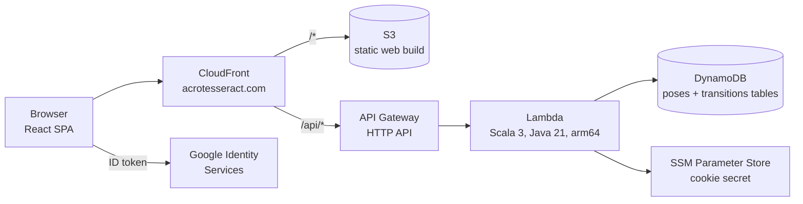
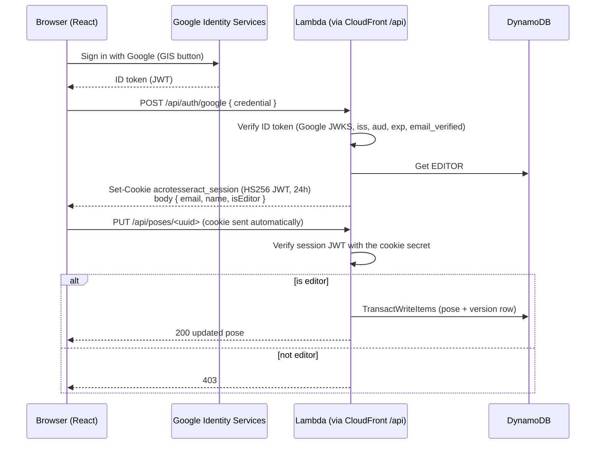

# Acro Tesseract Modernization

*Design doc. Status: in progress; the read path is live with static data, as of 2026-09-24.*

## Summary

Acro Tesseract will be rebuilt as a serverless app in a single monorepo. The main changes:

- **Frontend:** a **React** single-page app, hosted on S3 + CloudFront.
- **Sign-in:** **Google Sign-In** (Google Identity Services).
- **Backend:** a **Scala** backend on **AWS Lambda**, behind API Gateway.
- **Database:** **DynamoDB** instead of RDS MySQL.
- **Infrastructure:** defined with the **AWS CDK**.

The repo will be an **Nx workspace** with three projects: `acrotesseract-frontend` (React), `acrotesseract-backend`
(Scala), and `acrotesseract-cdk` (CDK).

The repo layout, CDK conventions, and Google sign-in flow **follow the existing Olympos repo** (`~/git/Olympos`). That
repo is an Nx monorepo with a React/Vite frontend, a TypeScript CDK app, and Google ID tokens exchanged for an
HttpOnly session cookie. Reusing its patterns means both projects are built, deployed, and debugged the same way. See
[Patterns reused from Olympos](#patterns-reused-from-olympos).

The current app is Play 2.6, Scala 2.11, sbt 0.13, and Java 8 on Elastic Beanstalk, and it has not changed since
March 2020. Every layer is past end of life, and the build depends on Bintray, which has shut down. The domain is
small: poses as nodes, transitions as directed edges between them, and a version history for each. That makes a
rewrite cheaper than a four-major-version Play upgrade. It is also a chance to fix the data-integrity and
authorization bugs listed below.

## Progress

The rebuild lives on the `modernization` branch. The legacy Play app stays on `master`. The branch started with no
shared history, so there's no `legacy/` folder.

| Area | Status |
|---|---|
| Nx workspace, sbt project, CDK app, onboarding README, `CLAUDE.md` | Done |
| AWS account | `acro-tesseract-prod` (`640110193230`, `us-west-2`), CDK-bootstrapped in `us-west-2` |
| Deployed stacks | Storage, API, cert (`us-east-1`) and web stacks for `prod` |
| Domain | **https://acrotesseract.com**: registered at GoDaddy, DNS in Route 53 zone `Z101167449K0416WE8MW`, ACM certificate for the bare domain and `www`, `www` → bare-domain 301 redirect, IPv4 + IPv6 |
| Data | `data/data.json`: 16 placeholder L-basing poses and 30 transitions, with UUID ids and legacy RDS column names, seeded into DynamoDB. See [Data source](#data-source) |
| DynamoDB | `acrotesseract-poses-prod` and `acrotesseract-transitions-prod` (see [Data model](#data-model-dynamodb)), seeded with `npx nx seed acrotesseract-backend` |
| Read API | `GET /api/health`, `/api/poses`, `/api/poses/{id}`, `/api/transitions`, `/api/transitions/{id}`, served from DynamoDB |
| Write API | `POST`/`PUT` for poses and transitions, with validation, optimistic locking, unique names and pose-existence checks. Tested against DynamoDB Local. **Disabled in prod (403)** until sign-in exists |
| React read pages | Home with search, pose and transition lists and detail pages, graph with focus, and a 404 page. See [docs/frontend-pages-plan.md](frontend-pages-plan.md) |
| Google sign-in, delete, version history, edit forms, admin | Not started (phase 2) |
| CI, alarms, OpenAPI spec | Not started |

## Background: the current system

### Current tech stack

These versions come from `build.sbt`, `project/`, and `public/library`. The end-of-life notes are approximate and
come from memory, not a fresh lookup.

| Layer | Current | Status |
|---|---|---|
| Language/web | Scala 2.11.11, Play 2.6.19, sbt 0.13.17 | All EOL |
| Runtime | Java 8 (`openjdk:8-jre` Docker image) | EOL image |
| DB access | Anorm 2.5.3, BoneCP, MySQL Connector/J 8.0.12 | Old or abandoned |
| Database | RDS MySQL, `dev` and `prod` schemas on **one** instance | Shared blast radius |
| Migrations | Flyway 5.2.0, run by un-ignoring a JUnit test | Manual |
| Auth | `play-googleauth` 0.7.7, hard-coded editor emails | Deprecated Google library |
| Secrets | AWS SDK v1 Secrets Manager | SDK v1 end of support |
| Frontend | Twirl + jQuery 3.3.1, Handlebars 4.0.12, Bootstrap 4.1.3, Cytoscape.js 3.2.18 + cola | jQuery/Handlebars have known CVEs |
| Analytics | Universal Analytics `UA-127156894-1` | UA has shut down |
| Hosting/CI | Elastic Beanstalk Docker, CodeBuild, manual zip upload, HTTP only | Manual; no TLS |

### Current data model

- **`Poses`** holds the graph's nodes: `pose_id` (auto-increment), unique `name`, `image_url`, `description_md`,
  `created_by`, and `created_ts`.
- **`Transitions`** holds the directed edges: `transition_id`, unique `name`, `description_md`, `pose_from`,
  `pose_to` (foreign keys to `Poses`), `youtube_url`, and `created_by`. The graph is a directed multigraph, so it
  allows parallel edges and self-loops.
- **`PosesVersions` / `TransitionsVersions`** hold full-row snapshots keyed by `(id, updated_ts)`.

### Problems the rewrite must fix

1. Pose updates write no version row. Transition updates write the version row *before* the update, in a separate
   connection, with no transaction.
2. A pose that has ever been used in a transition can't be deleted. The `TransitionsVersions` foreign keys still
   reference it, and the user sees a raw constraint error.
3. Create, edit, and delete routes for poses and transitions have no auth check. `created_by` is always `"TODO"`.
4. `description_md` is not rendered as Markdown. `insertPose` throws when `image_url` is empty.
5. Graph page: the `focusPose` parameter is ignored, the layout re-runs on every `drag` event, the payload includes
   unused fields, and edges can't be clicked.
6. There is no TLS, deploys are manual, and dev and prod share a database.

## Goals and non-goals

**Goals**

- One monorepo that builds, tests, and deploys all three parts from CI with a single pipeline.
- Anyone can browse, search, and explore the graph. Only allow-listed editors can create, edit, or delete content,
  and the real author is recorded.
- Every write records a version row atomically with the change. Referential integrity is enforced: a transition's
  poses must exist, and a pose with transitions can't be deleted.
- Pose and transition ids are UUIDs, so any client can mint an id and ids never collide across environments.
- The legacy URLs don't need to keep working. The legacy database is gone (see [Data source](#data-source)), so
  there are no old links worth preserving.
- HTTPS everywhere. Separate dev and prod environments.
- Near-zero cost at idle.

**Non-goals**

- New domain concepts (for example sequences or flows), comments, or public sign-up.
- Full-text search infrastructure (OpenSearch). The dataset is hundreds of items, not millions.
- Server-side rendering or SEO work beyond basic meta tags.

## Architecture



- **A single origin.** CloudFront serves the SPA from S3 and forwards `/api/*` to API Gateway. Everything is on
  the same origin, so the API needs no CORS setup and the browser always sees one domain.
- **SPA routing.** CloudFront returns `index.html` for unknown paths, so deep links like `/poses/<uuid>` load the
  app. React Router then renders the right page.
- **API.** API Gateway **HTTP API** (v2) with a Lambda proxy integration and no API Gateway authorizer. The
  Lambda checks the session cookie itself (see below). Read routes are public.
- **Backend.** A single Scala Lambda function (a "Lambdalith") with an in-process router. The API is about 15
  routes over 2 entities. One function means one cold-start pool, one artifact, and simpler CDK.
- **Data.** Two DynamoDB tables (poses, transitions; on-demand billing). See [Data model](#data-model-dynamodb).

### Sign-in and authorization

This is the Olympos flow (`olympos-fastapi/main.py` `/api/auth/google` + `LoginModal.tsx`), ported to Scala.



- **Frontend.** Load the GIS script and call `google.accounts.id.initialize` / `renderButton` from a
  `LoginModal`, with typed globals in `google.d.ts`, the same way Olympos does. Olympos doesn't use a wrapper
  library. The client ID comes from `VITE_GOOGLE_CLIENT_ID_LOCAL` / `VITE_GOOGLE_CLIENT_ID_PROD`, following
  Olympos's split between the local and prod OAuth clients. The ID token is sent once to `/api/auth/google` and
  then thrown away. The frontend never stores a token.
- **Login endpoint.** `POST /api/auth/google` verifies the Google ID token in Scala using `nimbus-jose-jwt` with a
  cached remote JWKS for `https://www.googleapis.com/oauth2/v3/certs`. It checks the issuer
  (`accounts.google.com`), the audience (our client ID), the expiry, and `email_verified`.
- **Session cookie.** Login issues a cookie named `acrotesseract_session`. It is a signed HS256 JWT with a 24h
  lifetime containing `{sub: email, name, editor}`, marked `HttpOnly; Secure; SameSite=Lax; Path=/`. This matches
  Olympos's `realestategpt_access_token` cookie. Because CloudFront serves the SPA and `/api` from one origin, the
  cookie is first-party. The client gets a 24h session instead of a 1h Google token.
- **Cookie secret.** The signing secret lives in SSM Parameter Store at `/acrotesseract/{stage}/cookie-secret` as a
  SecureString, following Olympos's `/olympos/{stage}/olympos-cookie-secret`. The Lambda reads it once during init,
  so SnapStart captures it in the snapshot. Rotating the secret signs everyone out.
- **CSRF protection.** Browsers don't send `SameSite=Lax` cookies on cross-site `POST`/`PUT`/`DELETE`, and the API
  also requires `Content-Type: application/json` on writes. That rules out form-post CSRF. There are no GET routes
  with side effects.
- **Authorization.** Every write handler re-reads `EDITOR#<email>`, so removing an editor takes effect
  immediately, without waiting for the cookie's `editor` flag to expire. The flag only drives the UI.
- **Logout.** `POST /api/auth/logout` clears the cookie. `GET /api/me` returns `{ email, name, isEditor }` or 401.
- **Why not an API Gateway JWT authorizer or Cognito?** Verifying the Google token at API Gateway would mean
  sending the 1h Google ID token as a bearer token on every call and re-prompting the user when it expires. Cognito
  adds user pools and hosted UI for one provider and a handful of editors. The cookie flow is already proven in
  Olympos, and it keeps both apps the same.

## Data model (DynamoDB)

**Two tables**, one per entity. This replaced an earlier single-table design, because two plain tables are easier to
read, seed and inspect in the console, and at this scale the single table's advantages don't matter. The schema is
defined in `acrotesseract-cdk/cdk/stacks/StorageStack.ts` and mirrored in `DynamoDbTables` (store module) for
DynamoDB Local. Both tables are on-demand, with **point-in-time recovery, deletion protection and
`RemovalPolicy.RETAIN`**.

### `acrotesseract-poses-<stage>`

| Attribute | Type | Notes |
|---|---|---|
| `poseId` | S (**partition key**) | UUID |
| `name`, `nameLower` | S | `nameLower` backs the unique-name check |
| `imageUrl`, `descriptionMd` | S, optional | Left off the item when empty |
| `version` | N | 1 on create, +1 on every update |
| `createdAt`, `updatedAt` | S | ISO-8601 instants |

| GSI | Keys | Projection | Used for |
|---|---|---|---|
| `byName` | `nameLower` | KEYS_ONLY | Is this name taken? (create and rename) |

### `acrotesseract-transitions-<stage>`

| Attribute | Type | Notes |
|---|---|---|
| `transitionId` | S (**partition key**) | UUID |
| `name`, `nameLower` | S | |
| `poseFrom`, `poseTo` | S | Pose UUIDs; a self-loop has both equal |
| `descriptionMd`, `youtubeUrl` | S, optional | |
| `version`, `createdAt`, `updatedAt` | N, S, S | As for poses |

| GSI | Keys | Projection | Used for |
|---|---|---|---|
| `byName` | `nameLower` | KEYS_ONLY | Unique-name check |
| `byPoseFrom` | `poseFrom` / `nameLower` | ALL | Transitions leaving a pose, sorted by name |
| `byPoseTo` | `poseTo` / `nameLower` | ALL | Transitions arriving at a pose, sorted by name |

### Access patterns

| Pattern | How |
|---|---|
| Get a pose / transition | `GetItem` (strongly consistent) |
| List all poses / transitions | `Scan` (paginated), sorted by name in the Lambda. Fine for hundreds of items; revisit past a few thousand |
| Transitions from / to a pose | `Query` on `byPoseFrom` / `byPoseTo` |
| Is a name taken? | `Query` on `byName` |
| Search | Client-side over the lists (see below) |

### Design decisions

- **Ids are UUIDs.** Pose and transition ids are canonical lowercase UUIDs (for example
  `5f9040d6-fdaf-444e-9e3b-83ae4da54843`), generated with `UUID.randomUUID()` on create. There's no counter item and
  no extra write per create, and ids from different environments or offline tools can't collide. The API rejects
  anything that isn't a canonical 8-4-4-4-12 UUID with 400. The tradeoff is that the legacy numeric URLs
  (`/poses/12`) don't carry over. The legacy database is gone, so there are no old links worth preserving.
- **Optimistic locking.** Every update sends the `version` it last read. The repository checks it and writes with
  `ConditionExpression: version = :expected`, so a stale update returns **409** instead of silently overwriting.
- **Unique names (case-insensitive)** are checked with a `byName` query before writing. It isn't transactional:
  two editors creating the same name at the same moment could both succeed, and GSIs are eventually consistent
  (usually under a second). That's accepted while there are only a couple of editors. If it ever matters, add
  name-guard items written in the same transaction.
- **Referential integrity.** A transition is written in a `TransactWriteItems` together with a `ConditionCheck`
  (`attribute_exists(poseId)`) on each endpoint pose, so it can never point at a missing pose (400, "To pose … does
  not exist"). A self-loop checks its pose once, because a transaction can't touch the same item twice.
- **Not built yet:**
  - **Delete.** A pose delete should be refused while `byPoseFrom` or `byPoseTo` still returns transitions.
  - **Version history.** It will need either a history table, or `VERSION#n` items keyed by id + version.
- **Search runs client-side.** The lists are a few KB for hundreds of items, and the SPA already loads them.
  Substring search in the browser is instant and needs no index. Revisit past about 10k items.
- **Markdown** is stored raw in `descriptionMd` and rendered in the browser with `react-markdown` and sanitization.
- **The legacy single table** `acrotesseract-prod` (from the first CDK deploy) was taken out of the stack but kept,
  because of its retain policy and deletion protection. It's empty and unused. Delete it by hand once no longer
  wanted.

## API

The API lives under `/api` and is JSON only.

- **Ids** are canonical UUID strings. Anything else gets 400.
- **Field names** are camelCase, and optional fields with no value are left out rather than sent as `null`.
- **Errors** are `{"error": "..."}` with the status code.
- **Writes** need `Content-Type: application/json` (415 otherwise; it also blocks form-post CSRF) and return the
  entity, including its new `version`. Validation limits match the legacy columns: name 1–256, imageUrl ≤256
  (http/https), descriptionMd ≤10000, youtubeUrl ≤1024 (YouTube hosts only).
- **Writes are off on deployed stages** (`writesEnabled: false` in `AcroTesseractStages.ts`, which sets
  `WRITES_ENABLED`) and return 403 until Google sign-in exists. Otherwise anyone could edit. They're on for
  `nx serve`.

| Method | Path | Auth | Status | Notes |
|---|---|---|---|---|
| GET | `/api/health` | public | **Live** | `{ status, stage }` |
| GET | `/api/poses` | public | **Live** (DynamoDB) | Sorted by name |
| GET | `/api/poses/{id}` | public | **Live** (DynamoDB) | `{ pose, transitionsFrom, transitionsTo }`; both lists are always present, possibly empty |
| GET | `/api/transitions` | public | **Live** (DynamoDB) | Sorted by name |
| GET | `/api/transitions/{id}` | public | **Live** (DynamoDB) | `{ transition, poseFrom, poseTo }` with both poses in full |
| GET | `/api/graph` | public | Planned | `{ poses: [{id, name, imageUrl}], transitions: [{id, name, from, to}] }`, cached by CloudFront for about 60s. Until it exists, the frontend uses the two list endpoints |
| POST | `/api/poses` | editor | **Built**; disabled in prod | Body `{ name, imageUrl?, descriptionMd? }`. 201 + `Location`. 409 on a duplicate name |
| PUT | `/api/poses/{id}` | editor | **Built**; disabled in prod | Body adds `version` (required). 409 if stale or the name is taken, 404 if missing |
| POST | `/api/transitions` | editor | **Built**; disabled in prod | Body `{ name, poseFrom, poseTo, descriptionMd?, youtubeUrl? }`. 400 if a pose doesn't exist or the URL isn't YouTube |
| PUT | `/api/transitions/{id}` | editor | **Built**; disabled in prod | Body adds `version` |
| GET | `/api/poses/{id}/versions` | public | Planned | Version history |
| GET | `/api/transitions/{id}/versions` | public | Planned | |
| DELETE | `/api/poses/{id}`, `/api/transitions/{id}` | editor | Planned | A pose delete is refused while it has transitions |
| POST | `/api/auth/google` | public | Planned | Body `{ credential }` (Google ID token). Sets the session cookie and returns `{ email, name, isEditor }` |
| POST | `/api/auth/logout` | public | Planned | Clears the session cookie |
| GET | `/api/me` | signed in | Planned | `{ email, name, isEditor }`, or 401 |
| GET | `/api/admin/stats` | editor | Planned | Counts |

The plan is for the contract to live in **`api/openapi.yaml`** as the single source of truth. That file doesn't exist
yet; for now the TypeScript types in `acrotesseract-frontend/src/api/types.ts` are hand-written to match the Scala
codecs. Once the spec exists:

- The frontend generates its TypeScript types from it with `openapi-typescript`.
- The Scala backend has a contract test that checks its JSON codecs against the spec's examples.

## Backend (Scala on Lambda)

| Concern | Choice | Why |
|---|---|---|
| Language | Scala 3.9 (current LTS) | Current. Clean enums and ADTs for the domain |
| Build | sbt 1.12 + `sbt-assembly` → one fat JAR | CDK points at the JAR path |
| Runtime | Lambda `java21`, arm64, 1024 MB | arm64 is cheaper. The memory size also buys CPU for startup |
| Cold start | **Lambda SnapStart** on a published version/alias | Makes JVM cold starts sub-second |
| AWS SDK | AWS SDK for Java **v2** DynamoDB client + `UrlConnectionHttpClient` | Smaller and faster to start than the Netty/Apache clients |
| DynamoDB mapping | Hand-written codecs over the low-level client | 2 entities. Avoids the enhanced client's Java-bean model. Scanamo is an option if it stays current for Scala 3 |
| JSON | `jsoniter-scala` | Compile-time codecs, fast startup, no reflection |
| Events | `aws-lambda-java-events` `APIGatewayV2HTTPEvent` | HTTP API payload v2 |
| Auth | `nimbus-jose-jwt`: Google ID token verification (remote JWKS) + HS256 session cookie | One small library for both JWT jobs |
| Config | `STAGE` env var (`local` / `prod`) → table name, SSM path, Google client ID | Replaces the hard-coded `AcroConfig` and Olympos's detect-local-by-port-8765 trick |
| Logging | Structured JSON to CloudWatch (Powertools-style fields: request id, route, user) | |

**Module layout:**

```
acrotesseract-backend/
  project.json  Nx targets wrapping sbt (build, test, serve, lint)
  build.sbt
  modules/
    domain/     Pose, Transition, Version, validation (pure; no AWS)
    store/      DynamoDB repository: key design, transactions, codecs
    api/        Router, handlers, JSON codecs, auth (Google token → session cookie → Editor)
    lambda/     Lambda entrypoint (thin adapter over api/)
    local/      Local HTTP server wrapping api/ for `nx serve` + DynamoDB Local
  src/test/     Unit tests; store tests run against DynamoDB Local (Testcontainers)
```

- **Routing.** A small pattern match on `(method, pathSegments)`, instead of a web framework. That keeps the
  startup path short.
- **SnapStart.** SDK clients are created during init so they are captured in the snapshot. No randomness is seeded
  at init.
- **Status codes.** Validation and domain errors map to 400, 403, 404, and 409. Anything unexpected is logged with
  the request id and returned as 500 with no stack trace.

**Alternatives considered:**

- **GraalVM native-image** on `provided.al2023` would give the fastest cold start, but it has a slower,
  reflection-sensitive build.
- **Scala.js on the Node runtime** would give fast starts, but the AWS SDK story is weaker.

We can move to either one later without changing the API, if SnapStart latency isn't good enough.

## Frontend (React)

| Concern | Choice |
|---|---|
| Tooling | React 19 + Vite + TypeScript + Vitest, CSS modules (the same shape as `olympos-frontend`) |
| Routing | React Router. The paths mirror today's: `/`, `/poses`, `/poses/:id`, `/poses/:id/edit`, `/poses/new`, `/transitions/...`, `/graph?focusPose=` |
| Data fetching | TanStack Query (caching, invalidation after writes) and a typed fetch client. The types are hand-written for now and will be generated from OpenAPI later |
| Auth | GIS script + `LoginModal` + `google.d.ts`, ported from Olympos. An `AuthProvider` calls `/api/me` on load and exposes `user`/`isEditor`. No token is kept in JS |
| UI | Hand-written CSS modules with CSS-variable tokens for light and dark themes, and no component library. This replaces Bootstrap 4 and jQuery |
| Markdown | `react-markdown` + `remark-gfm` (as in Olympos) + `rehype-sanitize`. The editor (phase 2) gets a preview tab |
| Video | The YouTube embed URL is derived client-side (`src/lib/youtube.ts`, a port of `YoutubeUrlParser`) and embedded from `youtube-nocookie.com` |
| Pages | See [docs/frontend-pages-plan.md](frontend-pages-plan.md) for how the legacy pages map to routes. The read-only pages (phase 1) are built and deployed |
| Tests | Vitest + React Testing Library. Playwright smoke tests run against a deployed dev stage |

### Graph visualization

The graph uses Cytoscape.js (current 3.x) with `cytoscape-cola`, wrapped in a `<PoseGraph>` component that owns the
Cytoscape instance through a `ref` and `useEffect`. It doesn't use `react-cytoscapejs`, which is thinly maintained.

It keeps the current behavior: pose nodes with labels, directed edges with arrowheads, force-directed Cola layout,
and clicking a node opens the pose page. It also fixes the current gaps:

- **Focus (built).** `/graph?focusPose=<uuid>` zooms to fit that pose and its neighbors. It highlights the pose, its
  in- and out-edges, and its neighbors, and dims the rest. The pose page's "View in graph" link uses this.
- **Performance (built).** The layout runs once on load, and again on `dragfree` (drag end) instead of on every
  `drag` event. The graph page is lazy-loaded, so Cytoscape (about 520 kB) isn't in the main bundle.
- **Edges (built).** Hovering an edge shows the transition name, and clicking it opens `/transitions/:id`. Parallel
  edges use `curve-style: bezier` so they don't overlap.
- **Theming (built).** Colors come from CSS variables, so the graph follows the light and dark themes.
- **Not yet built:** caching positions in `sessionStorage`, and a search box on the graph page that highlights
  matching nodes. For now, search lives on the home page.

## Infrastructure (AWS CDK)

The CDK app is written in **TypeScript** and laid out like `olympos-cdk`. It shares the Node toolchain with the
frontend, and TypeScript is CDK's first-class language. There are no official Scala bindings.

- **Entry point and runner.** `cdk.json` runs `tsx cdk/AcroTesseractCdkApp.ts`.
- **Stages.** `cdk/AcroTesseractStages.ts` lists `{ stageName, accountId, region, domainName, hostedZoneId,
  googleClientId }` per stage. It improves on Olympos, which derives the stage name from the array index
  (`index === 0 ? 'prod' : ...`).
- **Naming.** Stacks are named `acrotesseract-<purpose>-stack-<stage>`, the same scheme as
  `olympos-ecs-stack-prod`.
- **Tests.** Every stack has a Jest `*.spec.ts` that asserts on `Template.fromStack`, as in Olympos.

**Stacks (per stage):**

| Stack | Resources |
|---|---|
| `acrotesseract-storage-stack-<stage>` | DynamoDB tables `acrotesseract-poses-<stage>` (GSI `byName`) and `acrotesseract-transitions-<stage>` (GSIs `byName`, `byPoseFrom`, `byPoseTo`); `PAY_PER_REQUEST`, PITR, deletion protection, `RemovalPolicy.RETAIN` (the same billing and retention as Olympos's users table) |
| `acrotesseract-api-stack-<stage>` | Lambda (arm64, `java21`, SnapStart, alias `live`; asset = the JAR built by `acrotesseract-backend:build`), HTTP API, `grantReadWriteData` on both tables, env `POSES_TABLE` / `TRANSITIONS_TABLE` / `WRITES_ENABLED`, read access to `/acrotesseract/<stage>/*` in SSM, log group with one-month retention. Alarms (5xx rate, p95 latency, throttles) are planned |
| `acrotesseract-web-stack-<stage>` | S3 bucket (private, Origin Access Control), CloudFront (S3 default behavior; `/api/*` → HTTP API with caching disabled and all viewer headers except `Host` forwarded), a viewer-request CloudFront Function that rewrites extension-less paths to `/index.html` (so API 404s aren't masked), `BucketDeployment` of the frontend's `dist/`, and Route 53 alias records when the stage has a domain |
| `acrotesseract-cert-stack-<stage>` | ACM certificate in **us-east-1** (CloudFront requires it), DNS-validated against the hosted zone the same way Olympos's `ECSStack` does. Cross-region reference to the web stack |

There's no VPC stack. Lambda talks to DynamoDB and SSM over public AWS endpoints, so we avoid the NAT Gateway cost
that Olympos's `VPCStack` carries.

**Secrets.** The only secret is the cookie-signing key. It is created once per stage with
`aws ssm put-parameter --type SecureString --name /acrotesseract/<stage>/cookie-secret`, the same pattern as
Olympos (CloudFormation can't create SecureString parameters). Google client IDs are public, so they live in the
stage config and in `.env` (`VITE_GOOGLE_CLIENT_ID_LOCAL` / `_PROD`, with an `.env.example` committed).

**Accounts and credentials.** Acro Tesseract has its own account, `acro-tesseract-prod` (`640110193230`,
`us-west-2`), in the same AWS organization and IAM Identity Center (`ferrocene` SSO session) as Olympos. That keeps
billing and blast radius separate. The CLI profile is `acrotesseract-prod`. Local deploys use SSO through a copy of
Olympos's `aws-sso.sh`, with no long-lived keys. CI uses GitHub OIDC.

The account must be CDK-bootstrapped once in `us-west-2`, and in `us-east-1` for the certificate stack.

**Cost (rough).** On-demand DynamoDB, a few thousand Lambda invocations, and CloudFront come to **a few dollars a
month**, mostly Route 53 and CloudFront. That compares with an always-on EB instance plus RDS today, and with the
ALB + NAT + Fargate floor Olympos pays.

## Monorepo layout (Nx)

The repo is an Nx workspace shaped like Olympos: one root `package.json`, `nx.json`, and `tsconfig.base.json`, and
the projects as top-level folders with a `project.json` each.

```
acrotesseract/
  package.json              Nx + CDK + React dependencies (only the `nx` package; no Nx plugins)
  nx.json                   targetDefaults with caching; no plugins
  tsconfig.base.json
  CLAUDE.md                 project guide for Claude Code (commands, architecture, conventions), as in Olympos
  data/
    data.json               placeholder poses + transitions (legacy RDS column names, UUID ids)
    data.schema.json        JSON Schema for data.json
  api/
    openapi.yaml            API contract (planned)
  acrotesseract-frontend/   React + Vite + TS (@nx/vite targets: dev, build, test, typecheck)
  acrotesseract-backend/    sbt multi-module Scala project (see above) + project.json
  acrotesseract-cdk/        CDK TypeScript app
    cdk.json
    cdk/AcroTesseractCdkApp.ts
    cdk/AcroTesseractStages.ts
    cdk/stacks/{Storage,Api,Web,Cert}Stack.ts + *.spec.ts
    project.json
  tools/
    seed-ddb/               loads data.json into DynamoDB (planned; reuses the backend's store module)
  docker-compose.yml        DynamoDB Local for dev + tests (planned)
  .github/workflows/        (planned)
    ci.yml                  PR: nx affected -t lint test build, cdk synth + diff
    deploy.yml              main → prod deploy (manual approval)
  docs/                     this design doc + frontend-pages-plan.md
```

**Nx targets.** Every target is an explicit `nx:run-commands` target in the project's `project.json`, so the
workspace needs only the `nx` package. There are no Nx plugins to keep in version lockstep. Olympos, by contrast,
uses `@nx/vite` inference and the `@nx-iac/aws-cdk` executors. The sbt targets declare `inputs` and `outputs` so
Nx can cache them.

| Project | Target | Runs | Depends on |
|---|---|---|---|
| `acrotesseract-backend` | `build` | `sbt lambda/assembly` → `modules/lambda/target/scala-3.9.0/acrotesseract-lambda.jar` | – |
| `acrotesseract-backend` | `test` | `sbt test` | – |
| `acrotesseract-backend` | `serve` | `sbt local/run` on `:8080` with `STAGE=local` (in-memory `data.json`); `-c dynamodb` uses DynamoDB Local on `:8000` | – |
| `acrotesseract-backend` | `seed` | Loads `data.json` into the prod tables (`-c local`: DynamoDB Local, creating the tables) | – |
| `acrotesseract-frontend` | `build` / `dev` / `test` / `typecheck` | Vite build / dev server on `:4200` (proxy `/api` → `:8080`) / Vitest / `tsc` | – |
| `acrotesseract-cdk` | `test` / `typecheck` | Jest template tests / `tsc` | – |
| `acrotesseract-cdk` | `package` | `cdk synth` | `acrotesseract-backend:build`, `acrotesseract-frontend:build` |
| `acrotesseract-cdk` | `diff` / `deploy` / `destroy` | `cdk … --app cdk.out --profile acrotesseract-prod`. `deploy -c quick` adds `--hotswap-fallback --no-rollback`, as in Olympos | `package` |

Olympos needs `container-build` and `container-push` targets (Podman → ECR) plus a separate `deploy-all`.
Acro Tesseract doesn't: CDK uploads the JAR and the `dist/` folder as assets, so `npx nx deploy acrotesseract-cdk`
is the whole deploy.

**Local development.** Run `docker compose up` (DynamoDB Local), then `npx nx serve acrotesseract-backend` and
`npx nx dev acrotesseract-frontend`. Sign-in works locally with the local Google OAuth client, whose authorized
origins include `http://localhost:4200`, the same split Olympos uses.

## Patterns reused from Olympos

| Area | Olympos today | Acro Tesseract |
|---|---|---|
| Monorepo | Nx workspace, top-level `olympos-*` projects | Same shape, `acrotesseract-*` projects |
| Frontend | React 19, Vite, Vitest, `react-markdown` + `remark-gfm` | Same |
| Google sign-in | GIS button in `LoginModal.tsx` → `POST /api/auth/google` → server verifies → HS256 JWT in an HttpOnly cookie (24h) | Same flow; verification in Scala instead of Python `google-auth` |
| Secrets | SSM `/olympos/{stage}/…` SecureStrings | SSM `/acrotesseract/{stage}/cookie-secret` |
| Google client IDs | `VITE_GOOGLE_CLIENT_ID_LOCAL` / `_PROD` | Same |
| CDK | TypeScript, `tsx` runner, stages file, `<app>-<purpose>-stack-<stage>`, Jest template tests, `@nx-iac/aws-cdk` targets with `quick` hotswap | Same |
| DynamoDB | `PAY_PER_REQUEST`, `RETAIN` | Same, plus PITR, deletion protection, GSIs |
| Compute | arm64 Fargate behind an ALB, in a VPC with NAT | arm64 Lambda, no VPC |
| AWS access | IAM Identity Center SSO + `aws-sso.sh` | Same |
| Repo guide | `CLAUDE.md` | Same |

**What we deliberately don't copy.** These came up while reviewing Olympos, and are worth fixing there too:

- **Build output in git.** `olympos-cdk` has compiled `.js`/`.d.ts` files next to the `.ts` sources, plus
  `cdk.out/` and `tsconfig.tsbuildinfo`, and some built frontend assets are tracked under `statics/`. Acro Tesseract
  gitignores all build output from day one.
- **Over-broad IAM.** Olympos's task role grants `dynamodb:*Table` actions, including `CreateTable`/`DeleteTable`,
  on `table/*`, plus a hard-coded `roleName` that would collide across stages. Acro Tesseract uses
  `table.grantReadWriteData(fn)` and lets CDK name roles.
- **Stage from array index.** Olympos derives stage names from the stages array index. Acro Tesseract uses an
  explicit `stageName`.
- **Local dev detected by port.** Olympos checks for `8765` in the command-line args. Acro Tesseract uses an explicit
  `STAGE` env var.
- **Mixed Nx versions.** Olympos pins `@nx/esbuild`/`@nx/jest` 18.3.5 next to `nx` 21.5.x and `@nrwl/workspace`
  19. Acro Tesseract pins every `@nx/*` package to one Nx version.
- **Scaffolding leftovers.** Olympos still has `SampleStack` and `src/main.ts` from the generator, a default Nx
  README, and a `CLAUDE.md` that's out of date. It still describes a password login and Claude 3.5 Haiku, though
  `main.py` no longer has the password path and the chatbot now uses Haiku 4.5. We'll delete the generator
  leftovers and keep `CLAUDE.md` in step with the code.
- **No CI.** Olympos's `nx.json` references `.github/workflows/ci.yml`, but the file doesn't exist. Acro Tesseract
  ships CI in phase 0.

## Data source

**The legacy data is gone.** The legacy RDS host (`acrotesseract-db.cgccqt70jhl5.us-west-2.rds.amazonaws.com`) no
longer resolves in DNS. Neither known AWS account (`377848413746`, `153828470603`) has an RDS instance or an Acro
Tesseract snapshot. The old standalone AWS account behind the Elastic Beanstalk app may still have a final snapshot.
If one turns up, restore it and run the migration below.

**Until then, the catalog is seeded from `data/data.json`:**

- **Contents:** 16 L-basing poses (Ground is the starting pose) and 30 basic transitions. Every pose can be reached
  from Ground, and every pose has a way out.
- **Format:** the field names match the legacy `Poses` / `Transitions` columns, but ids are UUIDs.
  `data/data.schema.json` describes the format. The backend's `StaticData` loader also checks the rules JSON Schema
  can't express: unique ids and names, and transitions that point at real poses.
- **Check before trusting it:** the descriptions are placeholders written from general knowledge.
- **Validate after editing:** `cd data && npx -p ajv-cli@5 -p ajv-formats ajv validate --spec=draft2020 -c ajv-formats -s data.schema.json -d data.json`

**Pose photos.** `master` still has three photos in `public/acrotesseract/img/poses/`: `bird.jpeg` (Front Bird),
`free_shoulder_stand.jpg` and `star_side_view.jpg`.

- **Mislabeled:** `free_shoulder_stand.jpg` actually shows Candlestick (shoulders in the base's hands).
- **A description to fix:** `star_side_view.jpg` shows Star with the legs together, which contradicts the current
  Star description ("legs split wide").
- **Unknown rights:** they have no photographer credit. Confirm permission before publishing them.
- **Not wired in yet:** every `image_url` in `data.json` is `null` for now.

**Loading into DynamoDB (done).** `npx nx seed acrotesseract-backend` (the `seed` main in the backend's `local`
module) writes every pose and transition from `data.json`, keeping their ids, at version 1. Items that already exist
are skipped, so it's safe to re-run, and it never overwrites edits. After editing `data.json`, only new ids are
added. If a legacy RDS snapshot is ever recovered, a variant of the tool would import it instead: map each old
integer id to a new UUID and rewrite `pose_from`/`pose_to`.

**Domain (done).** The site moved to a new domain, `acrotesseract.com`, instead of reusing `acrotesseract.info`.
- **Registration and DNS:** the domain is registered at GoDaddy, and its nameservers point at a Route 53 hosted zone
  in the prod account. The zone was created with the CLI rather than CDK, so a stack teardown can never change the
  nameservers the registrar points at.
- **What CDK manages:** the ACM certificate (cert stack in `us-east-1`, DNS-validated), the alias records (A and
  AAAA for the bare domain and `www`), and a CloudFront Function that 301-redirects `www` to the bare domain.
- **The old domain:** `acrotesseract.info` isn't used by the new stack.
- **Cutover:** there was no legacy site left to run alongside it.

## Delivery plan

| Phase | Scope | Exit criteria | Status |
|---|---|---|---|
| 0. Scaffold | Nx workspace, sbt project + Nx targets, CDK skeleton + stages, CI (affected build/test + synth), `CLAUDE.md` | CI green on an empty app; `cdk deploy` creates the table, a hello Lambda, and the site | Done, except CI |
| 1. Read path | Read API, React list/detail pages, graph page (parity + focus), DynamoDB store + seed from `data.json` | Site browsable with seeded data from DynamoDB | **Done** |
| 2. Auth + writes | Google Sign-In (Olympos flow), session cookie, SSM secret, editor check, create/edit/delete with transactions, versions, 409 handling | All write flows work for editors, and non-editors get 403 | Create/update API built (disabled in prod); sign-in, delete, history and forms remaining |
| 3. Polish | History view, `/api/graph`, alarms, pose photos, Playwright smoke | Feature parity with the legacy app plus the fixed bugs | Markdown and search done early (phase 1) |
| 4. Domain + cut over | Hosted zone and cert stack, custom domain DNS | Site served on the real domain over HTTPS | **Done**: https://acrotesseract.com |
| 5. Decommission | Tear down whatever is left of the old EB/CodeBuild setup and secrets | No legacy resources billed | Not started; the RDS database is already gone |

## Risks

| Risk | Mitigation |
|---|---|
| JVM cold start on rarely hit endpoints | SnapStart. Lean dependencies (jsoniter, URLConnection client). Measure p95 in dev; native-image is the fallback |
| The session cookie expires (24h) mid-edit | The edit form keeps unsaved state in memory. A 401 opens the `LoginModal` and retries the save |
| The sbt build doesn't fit Nx caching | Explicit `inputs`/`outputs` on the `run-commands` targets. sbt's own incremental compile covers the rest |
| Single-table design is harder to change later | Access patterns are enumerated above. Generic GSI attribute names leave room for new patterns |
| Losing data once editing starts | PITR and deletion protection on the table, version rows on every write, and `data.json` as a known-good seed |
| Losing the domain's DNS | The hosted zone lives outside CDK, so no stack operation can delete it or change its nameservers |

## Open questions

- **Shared code with Olympos:** copy the GIS `LoginModal` and CDK patterns now, or extract them into a shared
  package later if a third project appears?
- **Editor management:** is it enough to seed `EDITOR#` items from the migration or CLI, or do we want an admin
  screen to add editors?
- **Images:** keep `imageUrl` pointing at external hosts, or add S3 uploads (presigned PUT) for pose images? And can
  the three legacy photos on `master` be published (see [Data source](#data-source))?
- **Legacy data:** does the old standalone AWS account still exist, with a final RDS snapshot worth restoring?
- **Analytics:** drop it, use GA4, or use a privacy-friendly option such as CloudFront logs or Plausible?
- **Pose deletion:** block it when transitions exist (as proposed), or cascade-delete its transitions after a
  confirm dialog?
