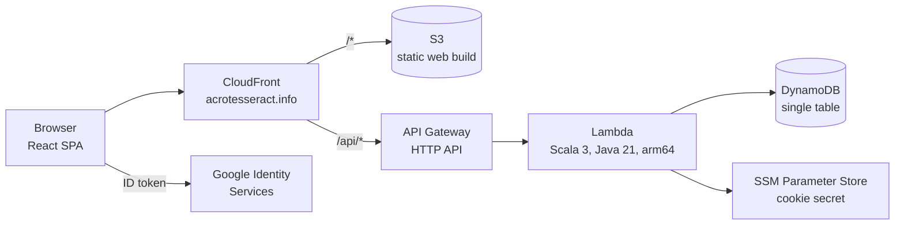
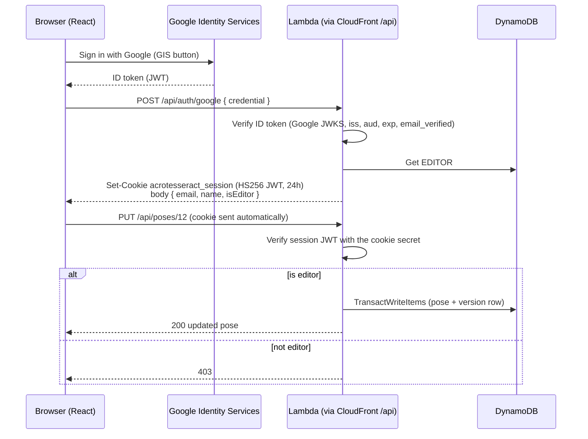

# Acro Tesseract Modernization

*Design doc. Status: draft, as of 2026-09-24.*

## Summary

Acro Tesseract will be rebuilt as a serverless app in a single monorepo. The main changes:

- **Frontend:** a **React** single-page app, hosted on S3 + CloudFront.
- **Sign-in:** **Google Sign-In** (Google Identity Services).
- **Backend:** a **Scala** backend on **AWS Lambda**, behind API Gateway.
- **Database:** **DynamoDB** instead of RDS MySQL.
- **Infrastructure:** defined with the **AWS CDK**.

The repo will be an **Nx workspace** with three projects: `acrotesseract-frontend` (React), `acrotesseract-backend`
(Scala), and `acrotesseract-cdk` (CDK).

The repo layout, CDK conventions, and Google sign-in flow **follow the existing Olympos repo** (`~/git/Olympos`). That
repo is an Nx monorepo with a React/Vite frontend, a TypeScript CDK app, and Google ID tokens exchanged for an
HttpOnly session cookie. Reusing its patterns means both projects are built, deployed, and debugged the same way. See
[Patterns reused from Olympos](#patterns-reused-from-olympos).

The current app is Play 2.6, Scala 2.11, sbt 0.13, and Java 8 on Elastic Beanstalk, and it has not changed since
March 2020. Every layer is past end of life, and the build depends on Bintray, which has shut down. The domain is
small: poses as nodes, transitions as directed edges between them, and a version history for each. That makes a
rewrite cheaper than a four-major-version Play upgrade. It is also a chance to fix the data-integrity and
authorization bugs listed below.

## Background: the current system

### Current tech stack

These versions come from `build.sbt`, `project/`, and `public/library`. The end-of-life notes are approximate and
come from memory, not a fresh lookup.

| Layer | Current | Status |
|---|---|---|
| Language/web | Scala 2.11.11, Play 2.6.19, sbt 0.13.17 | All EOL |
| Runtime | Java 8 (`openjdk:8-jre` Docker image) | EOL image |
| DB access | Anorm 2.5.3, BoneCP, MySQL Connector/J 8.0.12 | Old or abandoned |
| Database | RDS MySQL, `dev` and `prod` schemas on **one** instance | Shared blast radius |
| Migrations | Flyway 5.2.0, run by un-ignoring a JUnit test | Manual |
| Auth | `play-googleauth` 0.7.7, hard-coded editor emails | Deprecated Google library |
| Secrets | AWS SDK v1 Secrets Manager | SDK v1 end of support |
| Frontend | Twirl + jQuery 3.3.1, Handlebars 4.0.12, Bootstrap 4.1.3, Cytoscape.js 3.2.18 + cola | jQuery/Handlebars have known CVEs |
| Analytics | Universal Analytics `UA-127156894-1` | UA has shut down |
| Hosting/CI | Elastic Beanstalk Docker, CodeBuild, manual zip upload, HTTP only | Manual; no TLS |

### Current data model

- **`Poses`** holds the graph's nodes: `pose_id` (auto-increment), unique `name`, `image_url`, `description_md`,
  `created_by`, and `created_ts`.
- **`Transitions`** holds the directed edges: `transition_id`, unique `name`, `description_md`, `pose_from`,
  `pose_to` (foreign keys to `Poses`), `youtube_url`, and `created_by`. The graph is a directed multigraph, so it
  allows parallel edges and self-loops.
- **`PosesVersions` / `TransitionsVersions`** hold full-row snapshots keyed by `(id, updated_ts)`.

### Problems the rewrite must fix

1. Pose updates write no version row. Transition updates write the version row *before* the update, in a separate
   connection, with no transaction.
2. A pose that has ever been used in a transition can't be deleted. The `TransitionsVersions` foreign keys still
   reference it, and the user sees a raw constraint error.
3. Create, edit, and delete routes for poses and transitions have no auth check. `created_by` is always `"TODO"`.
4. `description_md` is not rendered as Markdown. `insertPose` throws when `image_url` is empty.
5. Graph page: the `focusPose` parameter is ignored, the layout re-runs on every `drag` event, the payload includes
   unused fields, and edges can't be clicked.
6. There is no TLS, deploys are manual, and dev and prod share a database.

## Goals and non-goals

**Goals**

- One monorepo that builds, tests, and deploys all three parts from CI with a single pipeline.
- Anyone can browse, search, and explore the graph. Only allow-listed editors can create, edit, or delete content,
  and the real author is recorded.
- Every write records a version row atomically with the change. Referential integrity is enforced: a transition's
  poses must exist, and a pose with transitions can't be deleted.
- Existing URLs such as `/poses/12` and `/transitions/7` keep working after the cutover.
- HTTPS everywhere. Separate dev and prod environments.
- Near-zero cost at idle.

**Non-goals**

- New domain concepts (for example sequences or flows), comments, or public sign-up.
- Full-text search infrastructure (OpenSearch). The dataset is hundreds of items, not millions.
- Server-side rendering or SEO work beyond basic meta tags.

## Architecture



- **A single origin.** CloudFront serves the SPA from S3 and forwards `/api/*` to API Gateway. Everything is on
  the same origin, so the API needs no CORS setup and the browser always sees one domain.
- **SPA routing.** CloudFront returns `index.html` for unknown paths, so deep links like `/poses/12` load the app.
  React Router then renders the right page, which keeps old URLs working.
- **API.** API Gateway **HTTP API** (v2) with a Lambda proxy integration and no API Gateway authorizer. The
  Lambda checks the session cookie itself (see below). Read routes are public.
- **Backend.** A single Scala Lambda function (a "Lambdalith") with an in-process router. The API is about 15
  routes over 2 entities. One function means one cold-start pool, one artifact, and simpler CDK.
- **Data.** A single DynamoDB table (on-demand billing) with 3 GSIs. See [Data model](#data-model-dynamodb).

### Sign-in and authorization

This is the Olympos flow (`olympos-fastapi/main.py` `/api/auth/google` + `LoginModal.tsx`), ported to Scala.



- **Frontend.** Load the GIS script and call `google.accounts.id.initialize` / `renderButton` from a
  `LoginModal`, with typed globals in `google.d.ts`, the same way Olympos does. Olympos doesn't use a wrapper
  library. The client ID comes from `VITE_GOOGLE_CLIENT_ID_LOCAL` / `VITE_GOOGLE_CLIENT_ID_PROD`, following
  Olympos's split between the local and prod OAuth clients. The ID token is sent once to `/api/auth/google` and
  then thrown away. The frontend never stores a token.
- **Login endpoint.** `POST /api/auth/google` verifies the Google ID token in Scala using `nimbus-jose-jwt` with a
  cached remote JWKS for `https://www.googleapis.com/oauth2/v3/certs`. It checks the issuer
  (`accounts.google.com`), the audience (our client ID), the expiry, and `email_verified`.
- **Session cookie.** Login issues a cookie named `acrotesseract_session`. It is a signed HS256 JWT with a 24h
  lifetime containing `{sub: email, name, editor}`, marked `HttpOnly; Secure; SameSite=Lax; Path=/`. This matches
  Olympos's `realestategpt_access_token` cookie. Because CloudFront serves the SPA and `/api` from one origin, the
  cookie is first-party. The client gets a 24h session instead of a 1h Google token.
- **Cookie secret.** The signing secret lives in SSM Parameter Store at `/acrotesseract/{stage}/cookie-secret` as a
  SecureString, following Olympos's `/olympos/{stage}/olympos-cookie-secret`. The Lambda reads it once during init,
  so SnapStart captures it in the snapshot. Rotating the secret signs everyone out.
- **CSRF protection.** Browsers don't send `SameSite=Lax` cookies on cross-site `POST`/`PUT`/`DELETE`, and the API
  also requires `Content-Type: application/json` on writes. That rules out form-post CSRF. There are no GET routes
  with side effects.
- **Authorization.** Every write handler re-reads `EDITOR#<email>`, so removing an editor takes effect
  immediately, without waiting for the cookie's `editor` flag to expire. The flag only drives the UI.
- **Logout.** `POST /api/auth/logout` clears the cookie. `GET /api/me` returns `{ email, name, isEditor }` or 401.
- **Why not an API Gateway JWT authorizer or Cognito?** Verifying the Google token at API Gateway would mean
  sending the 1h Google ID token as a bearer token on every call and re-prompting the user when it expires. Cognito
  adds user pools and hosted UI for one provider and a handful of editors. The cookie flow is already proven in
  Olympos, and it keeps both apps the same.

## Data model (DynamoDB)

### Access patterns

| # | Access pattern | Served by |
|---|---|---|
| A1 | Get a pose by id | `GetItem` PK=`POSE#<id>`, SK=`META` |
| A2 | Get a transition by id | `GetItem` PK=`TRANSITION#<id>`, SK=`META` |
| A3 | List all poses, sorted by name | `Query` GSI1 PK=`TYPE#POSE` |
| A4 | List all transitions, sorted by name | `Query` GSI1 PK=`TYPE#TRANSITION` |
| A5 | Transitions **from** a pose | `Query` GSI2 PK=`FROM#<poseId>` |
| A6 | Transitions **to** a pose | `Query` GSI3 PK=`TO#<poseId>` |
| A7 | Whole graph (all nodes + edges) | A3 + A4 (GSI1 projects only the graph fields) |
| A8 | Unique names | Name-guard items written in the same transaction |
| A9 | Version history of a pose or transition | `Query` PK=`POSE#<id>`, SK `begins_with VERSION#` |
| A10 | Is this user an editor? | `GetItem` PK=`EDITOR#<email>`, SK=`EDITOR` |
| A11 | Search by name | Client-side over the A7 payload (see below) |
| A12 | Counts for the admin page | A3/A4 with `Select=COUNT` |

### Table: `AcroTesseract`

Key attributes: `PK` (string), `SK` (string). Billing: on-demand. **Point-in-time recovery is on, deletion
protection is on, and the removal policy is `RETAIN`.**

| Item | PK | SK | Other attributes | GSI keys |
|---|---|---|---|---|
| Pose | `POSE#<id>` | `META` | `name`, `imageUrl?`, `descriptionMd?`, `createdBy`, `createdAt`, `updatedBy`, `updatedAt`, `version`, `edgeCount` | GSI1: `TYPE#POSE` / `<lower(name)>` |
| Pose version | `POSE#<id>` | `VERSION#<version, zero-padded to 6>` | Full snapshot + `op` (`create`/`update`/`delete`), `by`, `at` | – |
| Transition | `TRANSITION#<id>` | `META` | `name`, `descriptionMd`, `poseFrom`, `poseTo`, `youtubeUrl?`, `createdBy`, `createdAt`, `updatedBy`, `updatedAt`, `version` | GSI1: `TYPE#TRANSITION` / `<lower(name)>`; GSI2: `FROM#<poseFrom>` / `TRANSITION#<id>`; GSI3: `TO#<poseTo>` / `TRANSITION#<id>` |
| Transition version | `TRANSITION#<id>` | `VERSION#<version>` | Full snapshot + `op`, `by`, `at` | – |
| Name guard | `NAME#POSE#<lower(name)>` or `NAME#TRANSITION#<lower(name)>` | `NAME` | `ownerId` | – |
| Id counter | `COUNTER#POSE` / `COUNTER#TRANSITION` | `COUNTER` | `value` (number) | – |
| Editor | `EDITOR#<email>` | `EDITOR` | `addedBy`, `addedAt` | – |

**GSIs** (the attribute names are generic so the indexes can be reused):

| Index | PK attr | SK attr | Projection | Used by |
|---|---|---|---|---|
| GSI1 `byType` | `GSI1PK` | `GSI1SK` | INCLUDE `name`, `poseFrom`, `poseTo`, `imageUrl` | A3, A4, A7, A12 |
| GSI2 `byFrom` | `GSI2PK` | `GSI2SK` | ALL | A5 |
| GSI3 `byTo` | `GSI3PK` | `GSI3SK` | ALL | A6 |

Only `META` items carry GSI attributes, so version, guard, counter, and editor items stay out of the indexes (sparse
indexes).

### Design decisions

- **Numeric ids are kept.** New ids come from an atomic `UpdateItem ADD value :1` on the counter item. This keeps
  the existing `/poses/12` URLs valid after migration. The migration sets each counter to `max(id) + 1`. A ULID
  would avoid the counter write, but it would break old links and make URLs ugly.
- **Every write is one `TransactWriteItems`.** It contains the `META` put/update, the `VERSION#n` put, name-guard
  changes, and `edgeCount` changes. This fixes the current "version row may or may not exist" bug.
- **Optimistic locking.** A client sends the `version` it last read, and the update is conditioned on
  `version = :expected`. A conflict returns **409** and the UI offers to reload. That replaces the current
  last-writer-wins behavior.
- **Unique names.** A create puts `NAME#…` with `attribute_not_exists(PK)`. A rename deletes the old guard and puts
  the new one in the same transaction. A violation returns 409 with a clear message.
- **Referential integrity without foreign keys.**
  - **Creating a transition** adds 1 to `edgeCount` on both endpoint poses, conditioned on
    `attribute_exists(PK)`. That guarantees both poses exist.
  - **Deleting a transition** subtracts 1 from `edgeCount` on both endpoint poses.
  - **Editing a transition's endpoints** moves the counts from the old poses to the new ones.
  - **Deleting a pose** is conditioned on `edgeCount = 0`. It fails with a readable 409 ("delete or re-point its
    N transitions first") instead of a constraint error.
  - **Self-loop:** when `poseFrom == poseTo`, a transaction can't touch the same item twice, so the code does a
    single `ADD edgeCount :2`.
- **History outlives deletes.** A delete writes a final `VERSION#n` with `op=delete` and removes only the `META`
  item and its name guard, so a deleted entity's history can still be read and restored.
- **Search runs client-side.** The graph payload (A7) is every name and every edge. It is a few KB for hundreds of
  items, and the SPA already loads it. Substring search over it in the browser is instant, needs no search index,
  and replaces the `LIKE` query. If the item count grows past about 10k, revisit with a server-side index.
- **One partition for `TYPE#…`.** GSI1 puts every pose under a single partition key. At this scale (well below
  1,000 items and a handful of writes a day), that is far below the partition limits.
- **Markdown** is stored raw in `descriptionMd`. It is rendered in the browser with `react-markdown` and
  sanitization, not rendered or stored as HTML on the server.

## API

The API lives under `/api` and is JSON only. Ids are numbers. Every write returns the updated entity, including its
new `version`.

| Method | Path | Auth | Notes |
|---|---|---|---|
| GET | `/api/graph` | public | `{ poses: [{id, name, imageUrl}], transitions: [{id, name, from, to}] }`. Also powers search. Cached by CloudFront for about 60s |
| GET | `/api/poses` | public | A3 |
| GET | `/api/poses/{id}` | public | Pose + `transitionsFrom` + `transitionsTo` (A1, A5, A6 in parallel) |
| GET | `/api/poses/{id}/versions` | public | A9 |
| POST | `/api/poses` | editor | Create |
| PUT | `/api/poses/{id}` | editor | Body includes `version` |
| DELETE | `/api/poses/{id}?version=n` | editor | 409 if `edgeCount > 0` |
| GET | `/api/transitions` | public | A4 |
| GET | `/api/transitions/{id}` | public | Transition + both endpoint poses |
| GET | `/api/transitions/{id}/versions` | public | |
| POST / PUT / DELETE | `/api/transitions[/{id}]` | editor | Same pattern as poses |
| POST | `/api/auth/google` | public | Body `{ credential }` (Google ID token). Sets the session cookie and returns `{ email, name, isEditor }` |
| POST | `/api/auth/logout` | public | Clears the session cookie |
| GET | `/api/me` | signed in | `{ email, name, isEditor }`, or 401 |
| GET | `/api/admin/stats` | editor | Counts |

The contract lives in **`api/openapi.yaml`**, which is the single source of truth:

- The frontend generates its TypeScript types from it with `openapi-typescript`.
- The Scala backend has a contract test that checks its JSON codecs against the spec's examples.

## Backend (Scala on Lambda)

| Concern | Choice | Why |
|---|---|---|
| Language | Scala 3.9 (current LTS) | Current. Clean enums and ADTs for the domain |
| Build | sbt 1.12 + `sbt-assembly` → one fat JAR | CDK points at the JAR path |
| Runtime | Lambda `java21`, arm64, 1024 MB | arm64 is cheaper. The memory size also buys CPU for startup |
| Cold start | **Lambda SnapStart** on a published version/alias | Makes JVM cold starts sub-second |
| AWS SDK | AWS SDK for Java **v2** DynamoDB client + `UrlConnectionHttpClient` | Smaller and faster to start than the Netty/Apache clients |
| DynamoDB mapping | Hand-written codecs over the low-level client | 2 entities. Avoids the enhanced client's Java-bean model. Scanamo is an option if it stays current for Scala 3 |
| JSON | `jsoniter-scala` | Compile-time codecs, fast startup, no reflection |
| Events | `aws-lambda-java-events` `APIGatewayV2HTTPEvent` | HTTP API payload v2 |
| Auth | `nimbus-jose-jwt`: Google ID token verification (remote JWKS) + HS256 session cookie | One small library for both JWT jobs |
| Config | `STAGE` env var (`local` / `prod`) → table name, SSM path, Google client ID | Replaces the hard-coded `AcroConfig` and Olympos's detect-local-by-port-8765 trick |
| Logging | Structured JSON to CloudWatch (Powertools-style fields: request id, route, user) | |

**Module layout:**

```
acrotesseract-backend/
  project.json  Nx targets wrapping sbt (build, test, serve, lint)
  build.sbt
  modules/
    domain/     Pose, Transition, Version, validation (pure; no AWS)
    store/      DynamoDB repository: key design, transactions, codecs
    api/        Router, handlers, JSON codecs, auth (Google token → session cookie → Editor)
    lambda/     Lambda entrypoint (thin adapter over api/)
    local/      Local HTTP server wrapping api/ for `nx serve` + DynamoDB Local
  src/test/     Unit tests; store tests run against DynamoDB Local (Testcontainers)
```

- **Routing.** A small pattern match on `(method, pathSegments)`, instead of a web framework. That keeps the
  startup path short.
- **SnapStart.** SDK clients are created during init so they are captured in the snapshot. No randomness is seeded
  at init.
- **Status codes.** Validation and domain errors map to 400, 403, 404, and 409. Anything unexpected is logged with
  the request id and returned as 500 with no stack trace.

**Alternatives considered:**

- **GraalVM native-image** on `provided.al2023` would give the fastest cold start, but it has a slower,
  reflection-sensitive build.
- **Scala.js on the Node runtime** would give fast starts, but the AWS SDK story is weaker.

We can move to either one later without changing the API, if SnapStart latency isn't good enough.

## Frontend (React)

| Concern | Choice |
|---|---|
| Tooling | React 19 + Vite + TypeScript + Vitest, CSS modules (the same shape as `olympos-frontend`) |
| Routing | React Router. The paths mirror today's: `/`, `/poses`, `/poses/:id`, `/poses/:id/edit`, `/poses/new`, `/transitions/...`, `/graph?focusPose=` |
| Data fetching | TanStack Query (caching, invalidation after writes), a typed fetch client from the OpenAPI types |
| Auth | GIS script + `LoginModal` + `google.d.ts`, ported from Olympos. An `AuthProvider` calls `/api/me` on load and exposes `user`/`isEditor`. No token is kept in JS |
| UI | A small component library (for example Mantine or MUI) or Tailwind. This replaces Bootstrap 4 and jQuery |
| Markdown | `react-markdown` + `remark-gfm` (as in Olympos) + `rehype-sanitize`. The editor has a preview tab |
| Video | The YouTube embed URL is derived client-side, replacing `YoutubeUrlParser` |
| Tests | Vitest + React Testing Library. Playwright smoke tests run against a deployed dev stage |

### Graph visualization

The graph uses Cytoscape.js (current 3.x) with `cytoscape-cola`, wrapped in a `<PoseGraph>` component that owns the
Cytoscape instance through a `ref` and `useEffect`. It doesn't use `react-cytoscapejs`, which is thinly maintained.

It keeps the current behavior: pose nodes with labels, directed edges with arrowheads, force-directed Cola layout,
and clicking a node opens the pose page. It also fixes the current gaps:

- **Focus.** `/graph?focusPose=12` centers and zooms on that node. It highlights the node, its in- and out-edges,
  and its neighbors, and dims the rest. The pose page's "Graph" link uses this.
- **Performance.** The layout runs once on load, and again on `free` (drag end) instead of on every `drag` event.
  Positions are cached in `sessionStorage`, so navigating back doesn't re-layout.
- **Edges.** Hovering an edge shows the transition name, and clicking it opens `/transitions/:id`. Parallel edges
  use `curve-style: bezier` so they don't overlap.
- **Search integration.** The search box filters and highlights matching nodes live, using the same `/api/graph`
  payload.
- **Theming.** Colors come from CSS variables, so the graph follows the light and dark themes.

## Infrastructure (AWS CDK)

The CDK app is written in **TypeScript** and laid out like `olympos-cdk`. It shares the Node toolchain with the
frontend, and TypeScript is CDK's first-class language. There are no official Scala bindings.

- **Entry point and runner.** `cdk.json` runs `tsx cdk/AcroTesseractCdkApp.ts`.
- **Stages.** `cdk/AcroTesseractStages.ts` lists `{ stageName, accountId, region, domainName, hostedZoneId,
  googleClientId }` per stage. It improves on Olympos, which derives the stage name from the array index
  (`index === 0 ? 'prod' : ...`).
- **Naming.** Stacks are named `acrotesseract-<purpose>-stack-<stage>`, the same scheme as
  `olympos-ecs-stack-prod`.
- **Tests.** Every stack has a Jest `*.spec.ts` that asserts on `Template.fromStack`, as in Olympos.

**Stacks (per stage):**

| Stack | Resources |
|---|---|
| `acrotesseract-storage-stack-<stage>` | DynamoDB table `acrotesseract-<stage>` + 3 GSIs, `PAY_PER_REQUEST`, PITR, deletion protection, `RemovalPolicy.RETAIN` (the same billing and retention as Olympos's users table). Exports the table |
| `acrotesseract-api-stack-<stage>` | Lambda (arm64, `java21`, SnapStart, alias `live`; asset = the JAR built by `acrotesseract-backend:build`), HTTP API, `table.grantReadWriteData(fn)`, read access to `/acrotesseract/<stage>/*` in SSM, log group with retention, alarms (5xx rate, p95 latency, throttles) |
| `acrotesseract-web-stack-<stage>` | S3 bucket (private, Origin Access Control), CloudFront (S3 default behavior; `/api/*` → HTTP API, caching disabled except `/api/graph`; cookies forwarded to `/api/*` only), SPA fallback, `BucketDeployment` of the frontend's `dist/`, Route 53 alias record |
| `acrotesseract-cert-stack-<stage>` | ACM certificate in **us-east-1** (CloudFront requires it), DNS-validated against the hosted zone the same way Olympos's `ECSStack` does. Cross-region reference to the web stack |

There's no VPC stack. Lambda talks to DynamoDB and SSM over public AWS endpoints, so we avoid the NAT Gateway cost
that Olympos's `VPCStack` carries.

**Secrets.** The only secret is the cookie-signing key. It is created once per stage with
`aws ssm put-parameter --type SecureString --name /acrotesseract/<stage>/cookie-secret`, the same pattern as
Olympos (CloudFormation can't create SecureString parameters). Google client IDs are public, so they live in the
stage config and in `.env` (`VITE_GOOGLE_CLIENT_ID_LOCAL` / `_PROD`, with an `.env.example` committed).

**Accounts and credentials.** Acro Tesseract has its own account, `acro-tesseract-prod` (`640110193230`,
`us-west-2`), in the same AWS organization and IAM Identity Center (`ferrocene` SSO session) as Olympos. That keeps
billing and blast radius separate. The CLI profile is `acrotesseract-prod`. Local deploys use SSO through a copy of
Olympos's `aws-sso.sh`, with no long-lived keys. CI uses GitHub OIDC.

The account must be CDK-bootstrapped once in `us-west-2`, and in `us-east-1` for the certificate stack.

**Cost (rough).** On-demand DynamoDB, a few thousand Lambda invocations, and CloudFront come to **a few dollars a
month**, mostly Route 53 and CloudFront. That compares with an always-on EB instance plus RDS today, and with the
ALB + NAT + Fargate floor Olympos pays.

## Monorepo layout (Nx)

The repo is an Nx workspace shaped like Olympos: one root `package.json`, `nx.json`, and `tsconfig.base.json`, and
the projects as top-level folders with a `project.json` each.

```
acrotesseract/
  package.json              Nx + CDK + React devDependencies (one version line: all @nx/* pinned to the same Nx release)
  nx.json                   plugins: @nx/vite, @nx/js/typescript; targetDefaults with caching
  tsconfig.base.json
  CLAUDE.md                 project guide for Claude Code (commands, architecture, conventions), as in Olympos
  aws-sso.sh                SSO login + credential export helper (from Olympos)
  api/
    openapi.yaml            API contract (source of truth)
  acrotesseract-frontend/   React + Vite + TS (@nx/vite targets: dev, build, test, typecheck)
  acrotesseract-backend/    sbt multi-module Scala project (see above) + project.json
  acrotesseract-cdk/        CDK TypeScript app
    cdk.json
    cdk/AcroTesseractCdkApp.ts
    cdk/AcroTesseractStages.ts
    cdk/stacks/{Storage,Api,Web,Cert}Stack.ts + *.spec.ts
    project.json
  tools/
    migrate-rds-to-ddb/     one-off migration (Scala, reuses the backend's store module)
  docker-compose.yml        DynamoDB Local for dev + tests (runs under Podman as in Olympos, or Docker)
  .github/workflows/
    ci.yml                  PR: nx affected -t lint test build, cdk synth + diff
    deploy.yml              main → prod deploy (manual approval)
  legacy/                   current Play app, moved here until cutover, then deleted
  docs/
```

**Nx targets.** Every target is an explicit `nx:run-commands` target in the project's `project.json`, so the
workspace needs only the `nx` package. There are no Nx plugins to keep in version lockstep. Olympos, by contrast,
uses `@nx/vite` inference and the `@nx-iac/aws-cdk` executors. The sbt targets declare `inputs` and `outputs` so
Nx can cache them.

| Project | Target | Runs | Depends on |
|---|---|---|---|
| `acrotesseract-backend` | `build` | `sbt lambda/assembly` → `modules/lambda/target/scala-3.9.0/acrotesseract-lambda.jar` | – |
| `acrotesseract-backend` | `test` | `sbt test` | – |
| `acrotesseract-backend` | `serve` | `sbt local/run` on `:8080` with `STAGE=local` | – |
| `acrotesseract-frontend` | `build` / `dev` / `test` / `typecheck` | Vite build / dev server on `:4200` (proxy `/api` → `:8080`) / Vitest / `tsc` | – |
| `acrotesseract-cdk` | `test` / `typecheck` | Jest template tests / `tsc` | – |
| `acrotesseract-cdk` | `package` | `cdk synth` | `acrotesseract-backend:build`, `acrotesseract-frontend:build` |
| `acrotesseract-cdk` | `diff` / `deploy` / `destroy` | `cdk … --app cdk.out --profile acrotesseract-prod`. `deploy -c quick` adds `--hotswap-fallback --no-rollback`, as in Olympos | `package` |

Olympos needs `container-build` and `container-push` targets (Podman → ECR) plus a separate `deploy-all`.
Acro Tesseract doesn't: CDK uploads the JAR and the `dist/` folder as assets, so `npx nx deploy acrotesseract-cdk`
is the whole deploy.

**Local development.** Run `docker compose up` (DynamoDB Local), then `npx nx serve acrotesseract-backend` and
`npx nx dev acrotesseract-frontend`. Sign-in works locally with the local Google OAuth client, whose authorized
origins include `http://localhost:4200`, the same split Olympos uses.

## Patterns reused from Olympos

| Area | Olympos today | Acro Tesseract |
|---|---|---|
| Monorepo | Nx workspace, top-level `olympos-*` projects | Same shape, `acrotesseract-*` projects |
| Frontend | React 19, Vite, Vitest, `react-markdown` + `remark-gfm` | Same |
| Google sign-in | GIS button in `LoginModal.tsx` → `POST /api/auth/google` → server verifies → HS256 JWT in an HttpOnly cookie (24h) | Same flow; verification in Scala instead of Python `google-auth` |
| Secrets | SSM `/olympos/{stage}/…` SecureStrings | SSM `/acrotesseract/{stage}/cookie-secret` |
| Google client IDs | `VITE_GOOGLE_CLIENT_ID_LOCAL` / `_PROD` | Same |
| CDK | TypeScript, `tsx` runner, stages file, `<app>-<purpose>-stack-<stage>`, Jest template tests, `@nx-iac/aws-cdk` targets with `quick` hotswap | Same |
| DynamoDB | `PAY_PER_REQUEST`, `RETAIN` | Same, plus PITR, deletion protection, GSIs |
| Compute | arm64 Fargate behind an ALB, in a VPC with NAT | arm64 Lambda, no VPC |
| AWS access | IAM Identity Center SSO + `aws-sso.sh` | Same |
| Repo guide | `CLAUDE.md` | Same |

**What we deliberately don't copy.** These came up while reviewing Olympos, and are worth fixing there too:

- **Build output in git.** `olympos-cdk` has compiled `.js`/`.d.ts` files next to the `.ts` sources, plus
  `cdk.out/` and `tsconfig.tsbuildinfo`, and some built frontend assets are tracked under `statics/`. Acro Tesseract
  gitignores all build output from day one.
- **Over-broad IAM.** Olympos's task role grants `dynamodb:*Table` actions, including `CreateTable`/`DeleteTable`,
  on `table/*`, plus a hard-coded `roleName` that would collide across stages. Acro Tesseract uses
  `table.grantReadWriteData(fn)` and lets CDK name roles.
- **Stage from array index.** Olympos derives stage names from the stages array index. Acro Tesseract uses an
  explicit `stageName`.
- **Local dev detected by port.** Olympos checks for `8765` in the command-line args. Acro Tesseract uses an explicit
  `STAGE` env var.
- **Mixed Nx versions.** Olympos pins `@nx/esbuild`/`@nx/jest` 18.3.5 next to `nx` 21.5.x and `@nrwl/workspace`
  19. Acro Tesseract pins every `@nx/*` package to one Nx version.
- **Scaffolding leftovers.** Olympos still has `SampleStack` and `src/main.ts` from the generator, a default Nx
  README, and a `CLAUDE.md` that's out of date. It still describes a password login and Claude 3.5 Haiku, though
  `main.py` no longer has the password path and the chatbot now uses Haiku 4.5. We'll delete the generator
  leftovers and keep `CLAUDE.md` in step with the code.
- **No CI.** Olympos's `nx.json` references `.github/workflows/ci.yml`, but the file doesn't exist. Acro Tesseract
  ships CI in phase 0.

## Data migration and cutover

1. **Export.** Read `Poses`, `Transitions`, `PosesVersions`, and `TransitionsVersions` from the prod MySQL schema.
2. **Transform** each table:
    - **Poses and transitions:** keep their ids and turn each into a `META` item.
    - **Version rows:** number them `VERSION#1..n` by `updated_ts`. A pose with no version rows (because of the
      `updatePose` bug) gets a synthesized `VERSION#1` from its current row.
    - **`edgeCount`:** compute it from the transitions.
    - **Name guards:** build them, and fail loudly on case-insensitive duplicates.
    - **Counters:** set each to `max(id) + 1`.
    - **Authors:** keep `created_by = "TODO"` as `"unknown"`.
3. **Load** with `BatchWriteItem` into the dev table, then verify: counts match, every edge's endpoints exist, and
   graph JSON from the old `/graph/data` equals the new `/api/graph` after normalizing field names.
4. **Cut over.**
    - Announce an edit freeze and run the migration against prod.
    - Point DNS (`www.acrotesseract.info`) to the new CloudFront distribution.
    - Keep EB and RDS running read-only for 2 weeks, then snapshot RDS and tear both down.
5. **Rollback.** Until teardown, switching DNS back to EB is the rollback. Edits made in the new system during that
   window would need to be replayed by hand.

## Delivery plan

| Phase | Scope | Exit criteria |
|---|---|---|
| 0. Scaffold | Nx workspace, sbt project + Nx targets, CDK skeleton + stages, CI (affected build/test + synth), `legacy/` move, `CLAUDE.md` | CI green on an empty app; `cdk deploy` to dev creates the table, a hello Lambda, and the site |
| 1. Read path | Store + read API, React list/detail pages, graph page (parity + focus) | Dev site browsable with migrated dev data |
| 2. Auth + writes | Google Sign-In (Olympos flow), session cookie, SSM secret, editor check, create/edit/delete with transactions, versions, 409 handling | All write flows work for editors, and non-editors get 403 |
| 3. Polish | Markdown, history view, search, alarms, Playwright smoke | Feature parity with the legacy app plus the fixed bugs |
| 4. Migrate + cut over | Migration tool, prod stage, DNS switch | Prod on the new stack; legacy read-only |
| 5. Decommission | Tear down EB, RDS, CodeBuild, and the old secrets; delete `legacy/` | AWS bill shows no EB or RDS |

## Risks

| Risk | Mitigation |
|---|---|
| JVM cold start on rarely hit endpoints | SnapStart. Lean dependencies (jsoniter, URLConnection client). Measure p95 in dev; native-image is the fallback |
| The session cookie expires (24h) mid-edit | The edit form keeps unsaved state in memory. A 401 opens the `LoginModal` and retries the save |
| The sbt build doesn't fit Nx caching | Explicit `inputs`/`outputs` on the `run-commands` targets. sbt's own incremental compile covers the rest |
| Single-table design is harder to change later | Access patterns are enumerated above. Generic GSI attribute names leave room for new patterns |
| Losing data during migration | Dry runs on dev, automated equivalence check, RDS snapshot kept after teardown, PITR on the table |
| Losing the CloudFront/ACM/DNS config during cutover | Lower the DNS TTL a day ahead. Test the new distribution on `new.acrotesseract.info` first |

## Open questions

- **Shared code with Olympos:** copy the GIS `LoginModal` and CDK patterns now, or extract them into a shared
  package later if a third project appears?
- **UI kit:** Mantine, MUI, or Tailwind? This affects how much of the graph page's styling we write by hand.
- **Editor management:** is it enough to seed `EDITOR#` items from the migration or CLI, or do we want an admin
  screen to add editors?
- **Images:** keep `imageUrl` pointing at external hosts, or add S3 uploads (presigned PUT) for pose images?
- **Analytics:** drop it, use GA4, or use a privacy-friendly option such as CloudFront logs or Plausible?
- **Pose deletion:** block it when transitions exist (as proposed), or cascade-delete its transitions after a
  confirm dialog?
